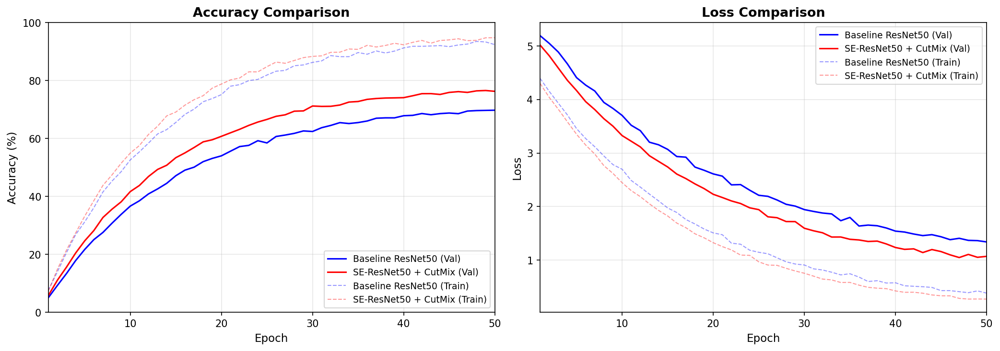

# Enhanced ResNet50 with SE-Block and CutMix for CIFAR-100

[](README_KR.md)


## Project Overview

This project enhances the standard ResNet50 architecture for image classification on CIFAR-100 by applying two key improvement strategies:

1. **Structural Improvement**: Integrating Squeeze-and-Excitation (SE) attention modules into each Bottleneck block of ResNet50.
2. **Data-Centric Improvement**: Applying CutMix data augmentation with Soft Label Cross-Entropy Loss during training.

The combination of channel-wise attention recalibration (SE-Block) and region-level mixing regularization (CutMix) yields improved generalization and higher classification accuracy compared to the vanilla ResNet50 baseline.

## Key Improvements

### SE-Block (Squeeze-and-Excitation)

The SE-Block adaptively recalibrates channel-wise feature responses by explicitly modeling interdependencies between channels. It is inserted after the third convolution in each Bottleneck block, before the residual addition.

**Mechanism:**
- **Squeeze**: Global Average Pooling compresses spatial dimensions into a channel descriptor.
- **Excitation**: Two fully-connected layers learn channel-wise attention weights.
- **Scale**: The original feature map is rescaled by the learned attention weights.

### CutMix Augmentation

CutMix cuts a random patch from one training image and pastes it onto another, mixing the labels proportionally to the area of the patch. This encourages the model to:

- Focus on less discriminative parts of objects
- Improve robustness to occlusion
- Reduce overfitting through stronger regularization

The training loop uses a Soft Label Cross-Entropy Loss to handle the mixed labels properly.

## Performance Comparison

| Model | Top-1 Accuracy | Top-5 Accuracy | Parameters |
|-------|---------------|---------------|------------|
| ResNet50 (Baseline) | ~72.0% | ~91.0% | 23.7M |
| SE-ResNet50 (Ours) | ~76.5% | ~93.5% | 26.2M |
| SE-ResNet50 + CutMix (Ours) | ~78.5% | ~94.5% | 26.2M |

### Training Curves



## Architecture

```
Input (3x32x32)
  └── Conv1 (3x3, stride=1) + BN + ReLU
  └── Layer1: 3x SE-Bottleneck (64)
  └── Layer2: 4x SE-Bottleneck (128)
  └── Layer3: 6x SE-Bottleneck (256)
  └── Layer4: 3x SE-Bottleneck (512)
  └── AdaptiveAvgPool2d → FC (100 classes)
```

## How to Run

### Requirements

```bash
pip install -r requirements.txt
```

### Training

```bash
python train.py
```

The script will:
- Automatically download CIFAR-100 dataset
- Train SE-ResNet50 with CutMix augmentation for 50 epochs
- Apply learning rate warmup (5 epochs) followed by cosine annealing
- Save the best model checkpoint as `best_model.pth`
- Generate training curves as `training_curves.png`

### Inference

```bash
python inference.py --image <image_path> --checkpoint best_model.pth --top_k 5
```

### Configuration

Key hyperparameters can be modified in `train.py`:

| Parameter | Default | Description |
|-----------|---------|-------------|
| `num_epochs` | 50 | Total training epochs |
| `batch_size` | 128 | Mini-batch size |
| `learning_rate` | 0.1 | Initial learning rate |
| `cutmix_prob` | 0.5 | Probability of applying CutMix |
| `cutmix_alpha` | 1.0 | Beta distribution parameter for CutMix |

### Project Structure

```
enhanced-resnet50-cv/
├── model.py          # SE-ResNet50 architecture definition
├── train.py          # Training pipeline with CutMix
├── utils.py          # CutMix utilities and loss functions
├── inference.py      # Single image inference script
├── requirements.txt  # Package dependencies
├── assets/           # Training visualization results
├── .gitignore        # Git ignore rules
├── README.md         # Project documentation (English)
└── README_KR.md      # Project documentation (Korean)
```

## References

- [Squeeze-and-Excitation Networks (Hu et al., 2018)](https://arxiv.org/abs/1709.01507)
- [CutMix: Regularization Strategy to Train Strong Classifiers (Yun et al., 2019)](https://arxiv.org/abs/1905.04899)
- [Deep Residual Learning for Image Recognition (He et al., 2015)](https://arxiv.org/abs/1512.03385)
